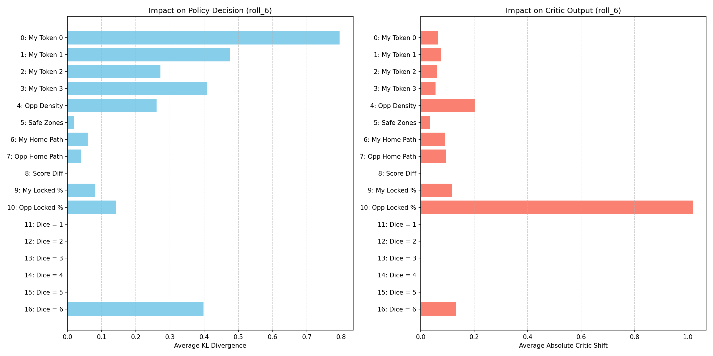
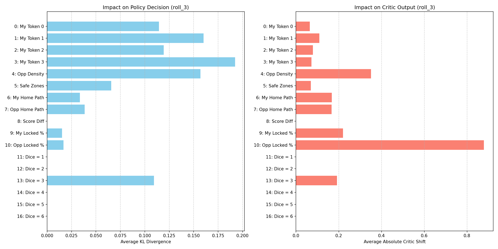
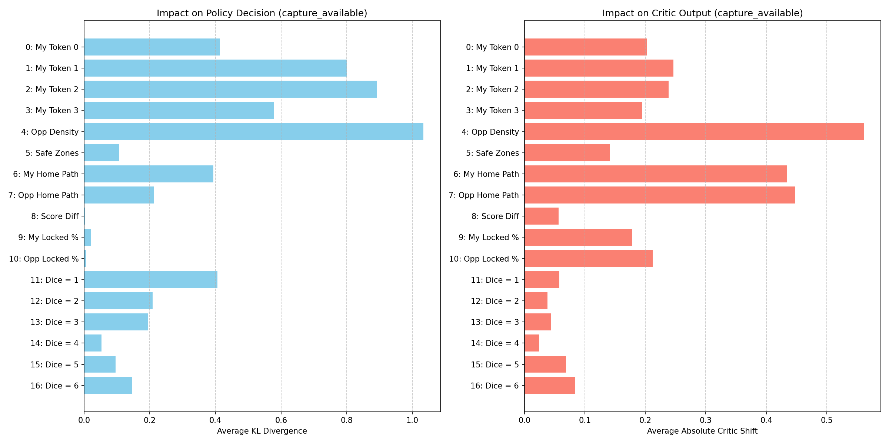
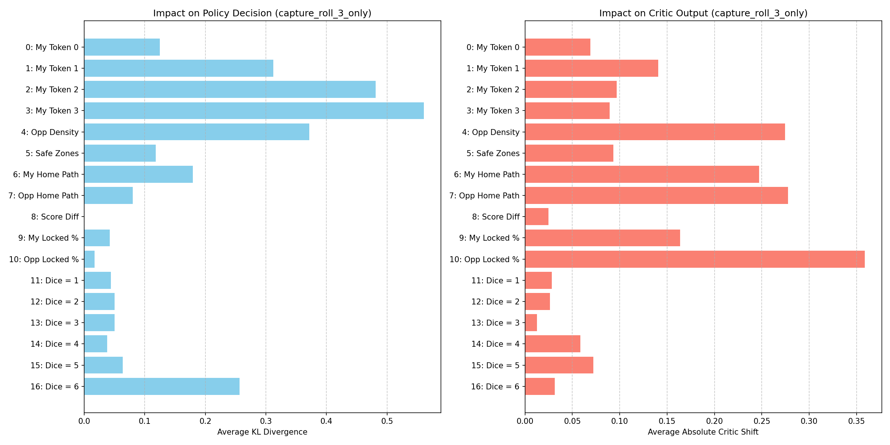
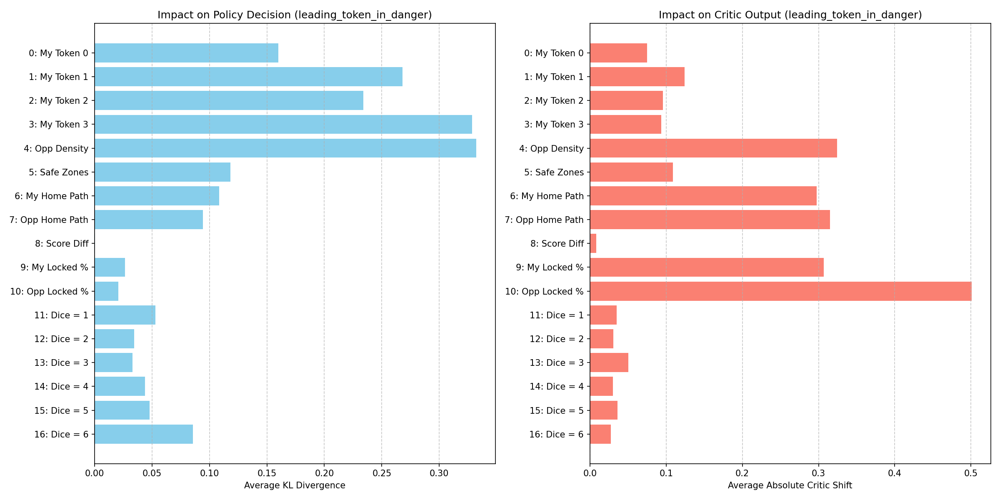
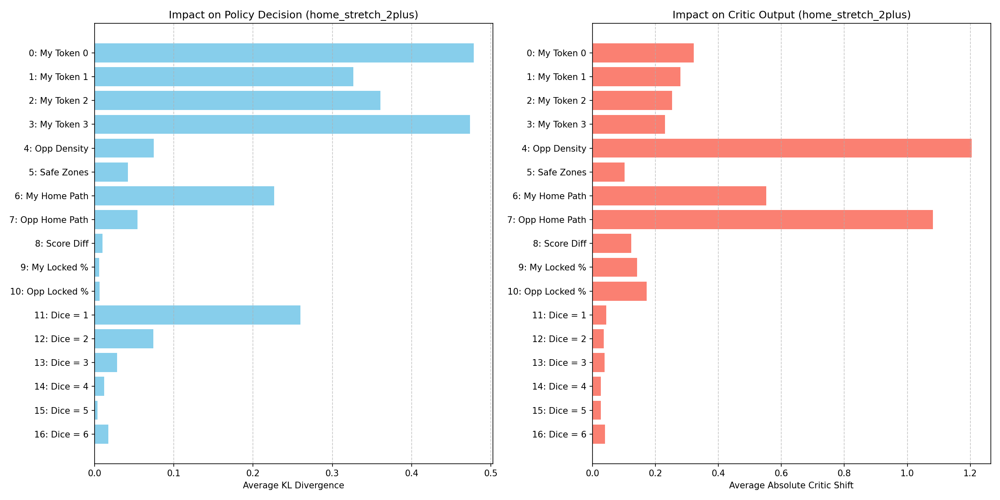

# Experiment 1: Channel Ablation Study

## Objective
Measure which of the 17 input channels the exported AlphaLudo checkpoint depends on most, both globally and in curated tactical situations.

## Methodology
- **Global sample:** 500 random decision states from 100 parallel two-player rollouts.
- **Curated buckets:** 200 states per bucket (50 for the rare `capture_roll_3_only` case).
- **Rollout fix:** If the current player has no legal move, we explicitly advance the turn to avoid stalled games.
- **Metrics:**
  - `Policy KL`: KL divergence between baseline policy and ablated policy.
  - `Critic MAE`: Mean absolute shift in the value head output.

## Global Visualization

## Curated Visualizations

## Global Metrics (Top Channels)

Top policy-sensitive channels:
- `Ch 0: My Token 0` -> `Policy KL = 0.3839`
- `Ch 1: My Token 1` -> `Policy KL = 0.1875`
- `Ch 10: Opp Locked %` -> `Policy KL = 0.1372`
- `Ch 3: My Token 3` -> `Policy KL = 0.1057`
- `Ch 2: My Token 2` -> `Policy KL = 0.1041`

Top critic-sensitive channels:
- `Ch 10: Opp Locked %` -> `Critic MAE = 1.8071`
- `Ch 4: Opp Density` -> `Critic MAE = 0.2158`
- `Ch 7: Opp Home Path` -> `Critic MAE = 0.0966`
- `Ch 9: My Locked %` -> `Critic MAE = 0.0794`
- `Ch 2: My Token 2` -> `Critic MAE = 0.0762`

## Curated Bucket Highlights

- **Roll 6 (`roll_6`)**: Dice channel `Ch 16` spikes (`Policy KL = 0.3981`) while other dice channels are effectively zero. This shows the dice effect gets washed out in the global average but is very strong when conditioning on the roll.
- **Roll 3 (`roll_3`)**: Dice channel `Ch 13` (roll 3) shows a clear bump (`Policy KL = 0.1094`) and all other dice channels are near zero. This directly supports your idea that roll-specific tactical moves need conditioned analysis.
- **Capture Available**: Opponent density (`Ch 4`, `Policy KL = 1.0330`) dominates, and **multiple dice channels** carry signal (`Ch 11-16` all non-trivial). Captures are a combined spatial + dice phenomenon.
- **Capture Roll 3 Only** (50 samples): Dice roll 3 is not the only thing the model is using. The spatial channels still dominate, and dice channels are only moderate. This bucket is rare and noisy, but it does confirm that dice-specific effects become visible only under conditioning.
- **Leading Token In Danger**: Opponent density and opponent home path are high for the critic, while self-token channels dominate policy shifts. Danger contexts appear to amplify both spatial and broadcast features.
- **Home Stretch 2+**: Critic becomes heavily dependent on opponent spatial channels (`Ch 4` and `Ch 7`) and the home path channel (`Ch 6`). Dice channel `Ch 11` jumps in policy, suggesting short-step tactics matter late game.

## Notes
- The value head output is a **critic score**, not a calibrated win probability.
- Full raw metrics for every bucket live in `experiments/01_channel_ablation/channel_ablation_metrics.json`.
