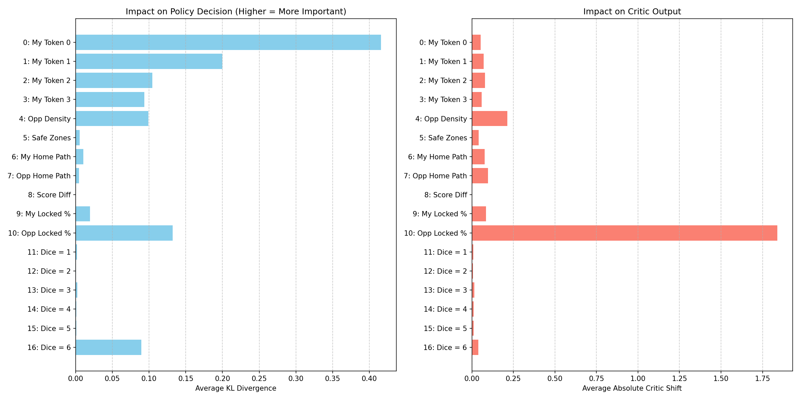

# Experiment 1: Channel Ablation Study

## Objective
Measure which of the 17 input channels the exported AlphaLudo checkpoint depends on most for policy choice and critic output.

## Methodology
- **States:** Collected **500** decision states from **100** parallel two-player random legal rollouts.
- **Rollout fix:** States with no legal move now explicitly advance to the next active player instead of stalling on the same turn.
- **Baseline:** Ran the checkpoint on each state with the legal-move mask enabled.
- **Ablation:** Zeroed one channel at a time and compared the ablated output to the baseline output.
- **Metrics:**
  - `Policy KL`: KL divergence between the baseline and ablated policy distributions.
  - `Critic MAE`: Mean absolute shift in the value head output.

## Results Visualization

## Fresh Metrics

Top policy-sensitive channels:
- `Ch 0: My Token 0` -> `Policy KL = 0.4159`
- `Ch 1: My Token 1` -> `Policy KL = 0.1999`
- `Ch 10: Opp Locked %` -> `Policy KL = 0.1321`
- `Ch 2: My Token 2` -> `Policy KL = 0.1043`
- `Ch 4: Opp Density` -> `Policy KL = 0.0991`

Top critic-sensitive channels:
- `Ch 10: Opp Locked %` -> `Critic MAE = 1.8387`
- `Ch 4: Opp Density` -> `Critic MAE = 0.2126`
- `Ch 7: Opp Home Path` -> `Critic MAE = 0.0977`
- `Ch 9: My Locked %` -> `Critic MAE = 0.0846`
- `Ch 2: My Token 2` -> `Critic MAE = 0.0796`

## Key Findings

1. **The policy is anchored strongly on the current player's token channels.**
   The biggest policy drop came from ablating `My Token 0`, and all four self-token channels land near the top of the policy ranking. The model is clearly reading token identity channels directly rather than treating them as interchangeable.

2. **`Opp Locked %` is the dominant global critic feature.**
   Channel 10 caused by far the largest critic shift (`1.8387` MAE), much larger than any spatial channel. The critic is using this broadcast feature as a strong summary of game progress.

3. **Opponent spatial information matters most after the self-token channels.**
   `Opp Density` is the second-largest critic feature and also a meaningful policy feature. The network is not acting from a pure racing heuristic; opponent placement is load-bearing.

4. **Safe zones and most dice channels have low average effect in this setup.**
   `Safe Zones` only caused `0.0055` policy KL, and dice channels `11-15` were near zero on average. The one exception is `Dice = 6` (`Ch 16`), which still shows a visible policy effect (`0.0896` KL), consistent with spawn and bonus-turn behavior.

5. **`Score Diff` had effectively no effect in this sample.**
   Channel 8 produced `0.0000` change for both outputs in this rerun, so it was not carrying useful signal on this batch of states.

## Notes
- The value head here should be read as a **critic score**, not a calibrated win probability.
- This experiment used random legal rollout states, not model self-play states.
