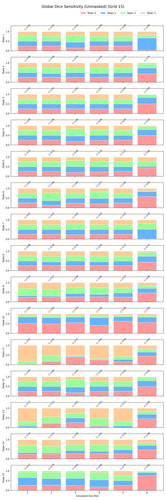
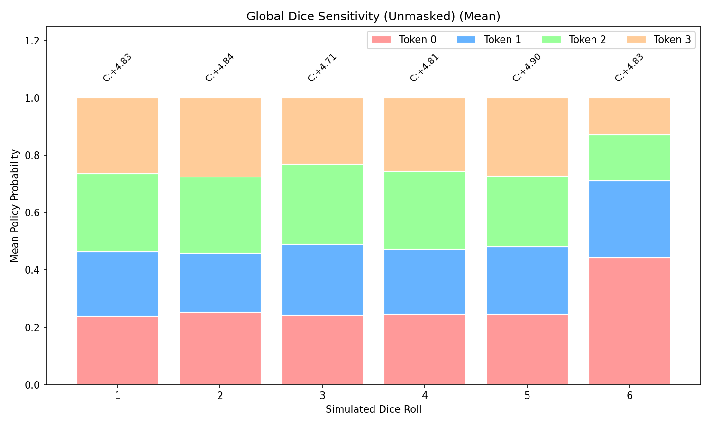
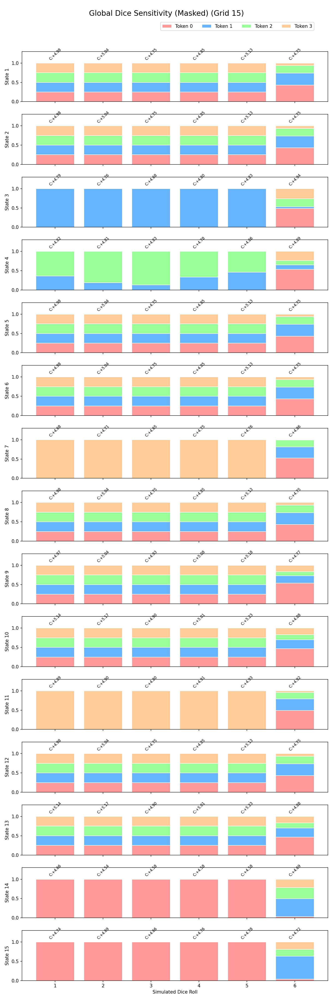

# Experiment 2: Dice Sensitivity Analysis

## Objective
Quantify how the policy and critic change across dice rolls, both globally and in tactical situations.

## Methodology
- **Global sample:** 300 decision states from random two-player rollouts.
- **Curated buckets:** 200 states per bucket (50 for the rare `capture_roll_3_only` case).
- **Masked + unmasked:** We run the dice sweep twice:
  - **Unmasked**: raw preference (legal mask = all ones).
  - **Masked**: legal mask recomputed per roll (what the model can actually play).
- **Sensitivity metrics:** Pairwise JS divergence, roll-to-roll flips, entropy/top-prob by roll, and critic stability.

## Global Visualizations

## Curated Visualizations

Roll-based:
- `roll_6`: `dice_sensitivity_roll_6_unmasked_avg.png`, `dice_sensitivity_roll_6_masked_avg.png`
- `roll_3`: `dice_sensitivity_roll_3_unmasked_avg.png`, `dice_sensitivity_roll_3_masked_avg.png`

Tactical buckets:
- `capture_available`: `dice_sensitivity_capture_available_unmasked_avg.png`, `dice_sensitivity_capture_available_masked_avg.png`
- `capture_roll_3_only`: `dice_sensitivity_capture_roll_3_only_unmasked_avg.png`, `dice_sensitivity_capture_roll_3_only_masked_avg.png`
- `leading_token_in_danger`: `dice_sensitivity_leading_token_in_danger_unmasked_avg.png`, `dice_sensitivity_leading_token_in_danger_masked_avg.png`
- `home_stretch_2plus`: `dice_sensitivity_home_stretch_2plus_unmasked_avg.png`, `dice_sensitivity_home_stretch_2plus_masked_avg.png`

## Global Metrics (Key Numbers)

Unmasked (raw preference):
- `flip_any_roll`: `295 / 300`
- `js_pairwise_mean`: `0.035`
- `roll_topprob_mean` for roll 6: `0.525` (higher than rolls 1–5, which sit around `0.31–0.33`)

Masked (legal moves enforced):
- `flip_any_roll`: `205 / 300`
- `js_pairwise_mean`: `0.139`
- `roll_topprob_mean` for roll 6: `0.525` (still the strongest single-roll concentration)

## Curated Bucket Highlights

- **Capture Available:** High JS and high flip rates in both masked and unmasked runs; dice sensitivity is strongest here, not just on roll 6.
- **Capture Roll 3 Only:** Roll 3 dominates the masked view (`roll_topprob_mean` for roll 3 is the peak), showing the model’s preference sharpens when a specific roll unlocks a capture.
- **Home Stretch 2+:** Masked policies become extremely confident on many rolls, with much higher JS divergence than the unmasked view. Late-game roll constraints matter.
- **Leading Token In Danger:** Dice sensitivity increases for the masked policy; roll-to-roll policy flips happen in almost every state in this bucket.

## Notes
- The value head output is a **critic score**, not a calibrated win probability.
- Full raw metrics and bucket counts are in `experiments/02_dice_sensitivity/dice_sensitivity_metrics.json`.
