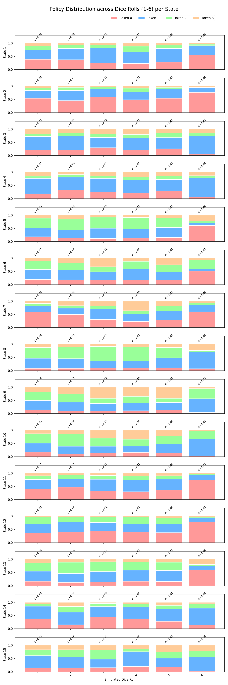

# Experiment 2: Dice Sensitivity Analysis

## Objective
Measure how much the model's token preference and critic output change when the board is held fixed and only the dice channels are changed.

## Methodology
- **States:** Collected **15** "interesting" decision states from corrected two-player random legal rollouts, biased toward positions with multiple tokens already out of base.
- **Intervention:** For each state, cloned the spatial channels and swept the dice one-hot channels from roll `1` through `6`.
- **Policy readout:** Disabled legal masking by using an all-ones mask, so the plot shows the model's raw preference over the four tokens.
- **Value readout:** Recorded the value-head output for each roll.

## Results Visualization

## Aggregate Metrics From The Saved Rerun

- States whose preferred token changed across the six rolls: `11 / 15`
- States whose preferred token changed specifically between roll `1` and roll `6`: `5 / 15`
- Mean max policy probability on roll `6`: `0.639`
- Mean max policy probability across rolls `1-5`: `0.432`
- Mean per-state critic-score standard deviation across rolls: `0.056`
- Mean per-state critic-score range across rolls: `0.166`

## Key Findings

1. **Dice matters a lot for policy, and often changes the preferred token entirely.**
   In this rerun, `11` of the `15` sampled states changed argmax token somewhere across the six dice values. The model is not using a single roll-agnostic token ranking.

2. **Roll `6` produces the sharpest decisions.**
   The average top-token probability jumps from `0.432` on rolls `1-5` to `0.639` on roll `6`. That is strong evidence that the model has learned special-case behavior tied to sixes.

3. **The critic is noticeably more stable than the policy.**
   The value head does move with dice, but much less than the policy does. Across the 15 states, the average critic-score standard deviation across rolls is only `0.056`.

4. **Not all dice sensitivity is just "spawn on 6".**
   Only `5 / 15` states changed preferred token specifically between roll `1` and roll `6`, while `11 / 15` changed somewhere across the full sweep. That suggests the model is also reacting to exact landing distances, not just the base-exit rule.

## Notes
- The value head output should be interpreted as a **critic score**, not a calibrated win probability.
- These are raw policy preferences with masking disabled, so illegal-token mass can still appear in the chart when the model finds a token intrinsically appealing for a given roll.
