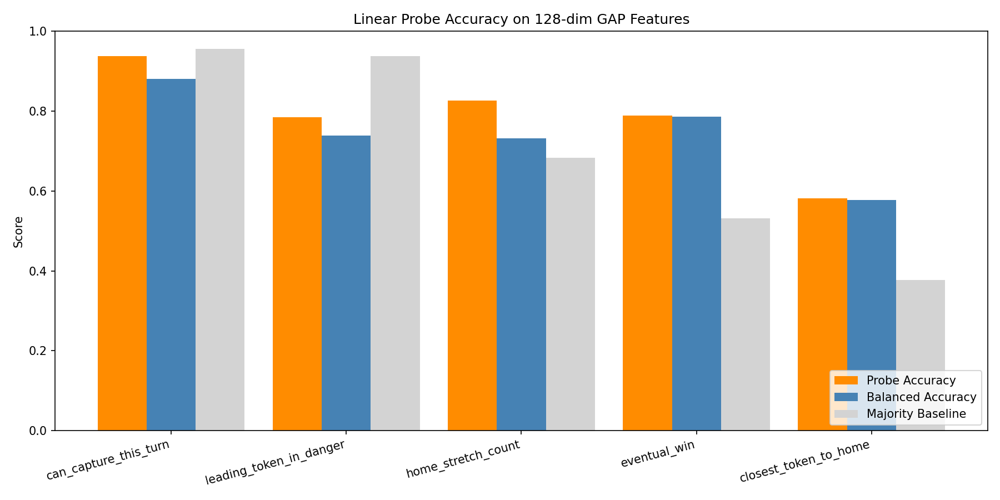

# Experiment 3: Linear Probes on GAP Features

## Objective
Test which game concepts are linearly decodable from the model's post-GAP backbone features.

## Methodology
- **Model features:** Extracted the backbone GAP vector from the exported checkpoint. For this checkpoint the feature size is **128**, not 64.
- **States:** Collected **2,500** decision states from completed two-player random rollouts.
- **Important fix:** Rollout collection now explicitly advances the turn when a player has no legal moves. Without that fix, games stall on the same player/dice state and the dataset becomes badly biased.
- **Labels:** Computed from raw `GameState` snapshots instead of rough tensor heuristics:
  - `can_capture_this_turn`
  - `leading_token_in_danger`
  - `home_stretch_count`
  - `eventual_win`
  - `closest_token_to_home`
- **Probe:** Standardized features + `LogisticRegression(class_weight="balanced")` with an 80/20 stratified split.
- **Metrics:** Reported both plain accuracy and balanced accuracy. Balanced accuracy is the more useful metric for rare labels such as capture opportunities.

## Results Visualization

## Probe Metrics

| Concept | Accuracy | Balanced Accuracy | Majority Baseline |
|---|---:|---:|---:|
| `can_capture_this_turn` | 0.938 | 0.881 | 0.956 |
| `leading_token_in_danger` | 0.784 | 0.739 | 0.937 |
| `home_stretch_count`* | 0.826 | 0.731 | 0.683 |
| `eventual_win` | 0.788 | 0.787 | 0.531 |
| `closest_token_to_home` | 0.582 | 0.577 | 0.377 |

\* One `home_stretch_count = 4` example appeared in the dataset; it was dropped for the probe split because a single sample is not enough to stratify/train reliably.

## Key Findings

1. **Eventual winner is strongly decodable.**
   The probe reached `0.787` balanced accuracy on `eventual_win`, which suggests the backbone carries a fairly explicit global advantage signal.

2. **Immediate tactical concepts are present but imbalanced.**
   `can_capture_this_turn` and `leading_token_in_danger` are both decodable, but they are rare in the sampled data. Plain accuracy is misleading here because the majority class is so dominant.

3. **Progress-to-home concepts are easier than token identity.**
   `home_stretch_count` probes well, while `closest_token_to_home` is only moderately decodable. That suggests the model encodes broad race progress more cleanly than exact token identity.

4. **The original broken probe setup was mostly measuring trivial labels.**
   The old script produced always-true concepts like "opponents visible" and "is vulnerable", so the earlier probe failures were due more to label design and rollout deadlocks than to the model itself.
